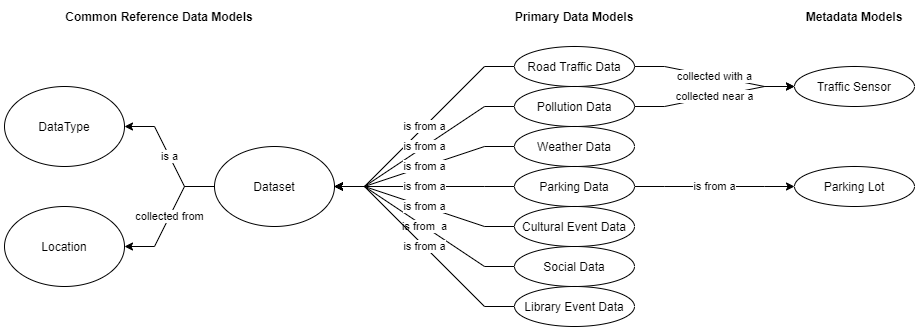
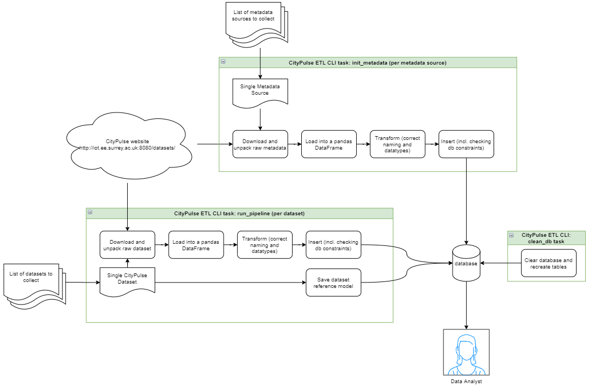

# CityPulse ETL - A MVP data pipeline for processing and consolidating Smart City data

Author: Sam Patterson

Date: 19.12.2012

## Executive Summary

A minimum viable product (MVP) has been developed to run an extract, transform, load (ETL) pipeline on a variety of Smart City datasets.

The publically accessible data has been successfully ingested into a database in a format appropriate for a data analyst to conduct visualisation and analysis of the data.

Since only one iteration of development has been condcuted, several potential improvements to the data model and pipeline are suggested. Nonentless, the fully functioning end-to-end tool demonstrates a range of quality data engineering practices which means it would be straightforward to improve with furhter iteration.

## Introduction

A mini-project has been undertaken over a weekend to build an [extract, transform, load (ETL)](https://en.wikipedia.org/wiki/Extract,_transform,_load) pipeline for Smart City data collected from the [CityPulse project](http://iot.ee.surrey.ac.uk:8080/datasets.html).

The purpose of the document is to describe the project's activities and outcomes. After outlining the goals and constraints of the project, the following sections describe the steps taken to complete the project. Finally, some discussion about potential uses cases and future work is given.

## Project goals and constraints

The primary goal of this project is to get the raw CityPulse datasets into a format that can be queried for visualisation and analysis.

To this end, the desired outcome of the project is a functioning end-to-end MVP of the pipeline which takes the raw data, applies basic transformations, and populates a target database.

The main constraint on this project is time. It is being performed by a single developer over a weekend as a recruitment challenge. Therefore, only one iteration of design and development is being conducted. This means that while the primary goal is being achieved, there will be plenty of potential follow up work to further iterate, refine and improve the solution.

In terms of technological constraints, since this project is starting from scracth and is being developed in isolation from any other systems, only open-source libraries and local computing resources are going to be used. However, technologies will be chosen that will enable the tool to be used with other databases and deployment environments.

## Explore and assess the data

The first step of the project is to explore the CityPulse datasets listed on their website to understand the variety and volume of data to be processed and ingested.

### Datasets

The following datasets are listed on the CityPulse website.

| Data type | City | Raw format | # Datasets listed |
| --- | --- | --- | --: |
| Road Traffic Data | Aarhus | Compressed CSV files | 4 |
| Pollution Data | Aarhus, Brasov | Compressed CSV files | 2 |
| Weather Data	 | Aarhus, Brasov | Compressed JSON files | 4 |
| Parking Data | Aarhus | CSV file | 2 |
| Social (Webcasted) Event Data | Surrey | CSV file | 1 |
| Cultural Event Data | Aarhus | CSV file | 1 |
| Library Event Data | Aarhus | CSV file | 1 |

In addition to these, the following meta data is also provided.

| Metadata | Relates to |
| --- | --- |
| Road Traffic Sensors | Road Traffic and Pollution Datasets |
| Parking Lots | Parking Datasets |

To begin with, the 'raw' format of the data was manually downloaded. However, several of the files were found to be duplicated and miscategorised in CityPulse's indexing of the files.

### Dataset index issues

Upon initial review of the linked datasets, the following issues were identified:

- The name of the linked file for the 'Aarhus Road Traffic Dataset-1' ([`citypulse_traffic_raw_data_surrey_feb_jun_2014.tar.gz`](http://iot.ee.surrey.ac.uk:8080/datasets/traffic/traffic_feb_june/citypulse_traffic_raw_data_surrey_feb_jun_2014.tar.gz)) indicates that it is from Surrey, however the metadata for these records indicates it is in Aarhus so it is being used as if it is from Aarhus.
- The linked file for the 'Aarhus Road Traffic Dataset-4' ([`cultural_events_aarhus.csv`](http://iot.ee.surrey.ac.uk:8080/datasets/aarhusculturalevents/cultural_events_aarhus.csv)) points to either 'Aarhus Cultural Event Dataset-1' or 'Aarhus Road Traffic Dataset-3'.
- The linked file for the 'Aarhus Parking Dataset-2' ([`aarhus_parking.csv`](http://iot.ee.surrey.ac.uk:8080/datasets/parking/aarhus_parking.csv)) points to the 'Aarhus Parking Event Dataset-1'.
- The linked file for the 'Brasov Pollution Dataset-1', 'Brasov Weather Dataset-1/2' files ([`citypulse_pollution_annotated_data_aarhus_aug_oct_2014.tar.gz`](http://iot.ee.surrey.ac.uk:8080/datasets/pollution/citypulse_pollution_annotated_data_aarhus_aug_oct_2014.tar.gz) and [`raw_weather_data_aarhus.tar.gz`](http://iot.ee.surrey.ac.uk:8080/datasets/weather/feb_jun_2014/raw_weather_data_aarhus.tar.gz) and [`raw_weather_data_aug_sep_2014.zip`](http://iot.ee.surrey.ac.uk:8080/datasets/weather/aug_sep_2014/raw_weather_data_aug_sep_2014.zip)) point to the same files from Aarhus.

An inspection into the [backend file structure of the website](http://iot.ee.surrey.ac.uk:8080/datasets) was conducted, however the correct files did not appear to be there either. In these cases, the duplicated files are being ignored from here on and in the developed tool.

### Extracting the data

To inspect the data more closely and begin building the initial 'extract' step of the ETL pipeline. Functions have been set up to automatically download and extract, where necessary, the datasets based on a JSON configuration file with the following format.

```json
[
    {
        "name": "Aarhus Road Traffic Dataset-1",
        "data_type": "Road Traffic Data",
        "url": "http://iot.ee.surrey.ac.uk:8080/datasets/traffic/traffic_feb_june/citypulse_traffic_raw_data_surrey_feb_jun_2014.tar.gz",
        "location": "Aarhus"
    },
    {
        "name": "Surrey Social Event Dataset-1",
        "data_type": "Social Event Data",
        "url": "http://iot.ee.surrey.ac.uk:8080/datasets/surreyevents/surrey_events.csv",
        "location": "Surrey"
    },
    ...
]
```

The following steps were taken to download each dataset, clean it, and read it into the Python development environment.

- Downloading raw files using the [requests](https://docs.python-requests.org/en/latest/) library and saving to a local data cache
- Unpacking from either `.tar.gz` or `.zip` archives where necessary
- Ignored non-data files (e.g. `__MACOSX` hidden directories)
- Applied column names to CSVs where they were missing (based on other similar files or the developer's best guess)
- Column names were converted into the same (`snake_case`) styling for consistency across the datasets
- Read into [pandas DataFrame](https://pandas.pydata.org/docs/reference/api/pandas.DataFrame.html) objects
- Setting correct data types (e.g. `datetime` for timestamps)
- Removing duplicated rows (e.g. columns with identical values from the road traffic datasets)
- Removing duplicated columns (e.g. urls in columns 2 and 4 of 'Surrey Social Event' dataset are identical)

## Define the data model

The initial design of the CityPulse ETL package comprises of a conceptual data model (which aligns with the tables of the relational database) along with the functional requirements of the command line tool that runs the ETL pipeline.

### First pass conceptual data model

A first iteartion of the conceptual data model was developed based on the key types of data.



The primary data models are the seven different types of datasets hosted CityPulse. Alongside these are the two metatata models provided that relate to the Road Traffic, Pollution, and Parking Lot data.

There are also three reference data models which align with how CityPulse indexes the data.

While there is potential for further normalisation of the data model, this model achieves the project's primary goal within the time constraints. Furthermore, it would be recommened to further refine and clarify the user cases for the data before investing more effort to design a more sophisticated model, following an agile approach.

### Functional design

A Command Line Interface (CLI) will be responsible for setting up the database and running the pipeline.



The CLI will run three tasks:

- `run-pipeline` - This runs the ETL pipeline on a collection of datasets hosted by CityPulse. It takes a json file with a list of dictionaries that defines the datasets to be processed by the pipeline.
- `init-metadata` - This initialises the metadata tables. It should be run each time the database is recreated and potentially more often if new metadata becomes available.
- `clean-db` - This clears all the data from the database and creates the empty tables. For development it is useful when making large changes to the pipeline. For deployment to production, it only needs to be run once.

## Run ETL to model the data

The above design has been developed as an MVP and is available in [CityPulse ETL](https://gitlab.com/s-a-m/citypulse-etl) GitLab repository.

### Technologies

The collection of technologies and libraries used have been selected based on familiarity to the developer, their maturity, and their popularity across the industry.

- [Python 3](https://www.python.org/) - often considered the default language to use in the data engineering / data science fields
- [SQLAlchemy](https://www.sqlalchemy.org/) - provides an abstraction away from the database which will allow the tool to work on different databases if required
- [pandas](https://pandas.pydata.org/) - gives powerful functionality for transforming large quantities of data
- [requests](https://docs.python-requests.org/en/latest/) - a widely-used and robust library for HTTP resources 
- [SQLite](https://www.sqlite.org/index.html) - a simple and self-contained SQL database

The tool has been built as a installable Python package that provides the CLI tool to the console when installed for ease-of-deployment.

As well as being useful for running the pipeline, installing the package also gives access to the SQLAlchemy ORM classes which could be used by a consumer to interact with the data instead of SQL.

### Using the tool

The project's [README file](https://gitlab.com/s-a-m/citypulse-etl/-/blob/main/README.md) describes how to install the tool.

#### Initialise the database

Once installed, the database can be initialised (incl. metadata) by running the following command:

```
citypulse-etl --metadata-json=metadata.json clean-db init-metadata run-pipeline
```

Which produces the following logs when succesful:

```
[2021-12-19 17:16:07,057] INFO cli - Database cleared.
[2021-12-19 17:16:07,112] INFO cli - Database initialised.
[2021-12-19 17:16:07,112] INFO metadata - Downloading the metadata...
[2021-12-19 17:16:07,239] INFO metadata - Read in metadata file...
[2021-12-19 17:16:07,348] INFO metadata - Downloading the metadata...
[2021-12-19 17:16:07,446] INFO metadata - Read in metadata file...
[2021-12-19 17:16:07,456] INFO cli - Metadata initialised.
```

#### Run the pipeline

Once the database is initialised, the ETL pipeline can then be run with the following command:

```
citypulse-etl --dataset-json=all-datasets.json run-pipeline
```

Which produces the following logs showing the progress (truncated for brevity):

```
[2021-12-19 17:17:08,105] INFO cli - Running pipeline for dataset: Aarhus Weather Dataset-1
[2021-12-19 17:17:08,105] INFO pipeline - Creating the dataset record (and location if required)...
[2021-12-19 17:17:08,138] INFO pipeline - Downloading raw dataset files...
[2021-12-19 17:17:08,334] INFO pipeline - Unpacking / listing dataset files...
[2021-12-19 17:17:08,351] INFO pipeline - Reading data/raw/dewptm.txt...
[2021-12-19 17:17:08,476] INFO pipeline - Reading data/raw/pressurem.txt...
[2021-12-19 17:17:08,569] INFO pipeline - Reading data/raw/wdird.txt...
...
```

Since the data model has implemented with column data type, foriegn key, uniqueness constraints, these constraints are checked upon insertion and are raised as exceptions by SQLAlchemy if they are violated. Transaction sessions are used to ensure that a only valid insertions from a completely sucessful pipeline is committed to the database.

## Discussion

This section discusses the developed tool from the perspective of using it or adapting it to meet some additional requirements.

### Streaming data in real time

Real-time collection of the data could be acieved with this tool in a number of ways.

In it's current form, the tool could be used quite easily for real-time data collection if the new datasets were made available with similar HTTP requests as they are now. In this case, the ETL pipeline itself would work, and all that would need to added is for the tool to automatically find new datasets to process, instead of being given a fixed list of them in the json configuration file. This could be achieved by periodically crawling the CityPulse server for datasets that have not already been processed then running them through the ETL pipeline as normal.

Alternatively, if the data became available via a different communication protocol more suited to real-time streaming (e.g. MQTT or WebSockets), then the tool could be adapted to run as a micro-service while it listens for updates. This would be relatively straightforward as it would use the majority of the existing pipeline code, and just require some alteration to the logic which runs the command and does the initial download of the raw data.

### 100x more IoT

In order to scale up to a much larger amount of IoT sensors, the first recommended change to the tool would be to hook it up to a larger database than SQLite. Since it uses SQLAlchemy, this would just be a matter of changing the database driver & connection string that it is using.

Aside from using a more scalable database, the current tool itself should be quite scalable since a run is defined by a json configuration and the pipeline processes and commits each dataset from an independent database session/transaction. This means that pipelines could be orchestrated and run in a distributed computing environment. For example, setting up a shared queue of pipeline _jobs_ and running them in parallel aross multiple worker machines or in a serverless architecture (e.g. Azure Functions / AWS Lambda).

#### Converting geographic coordinates into human-readable addresses

Converting the longitude and latitude data into human-readable addresses would be particuarly useful for presenting the data in the dashboard for end-users.

This could be achieved by either appending the existing pipeline or setting up an additional pipeline that uses a web service, like [Google's Reverse Geocoding API](https://developers.google.com/maps/documentation/geocoding/overview#ReverseGeocoding), to convert the longitude and latitude values in to addresses then saves that to the database.

#### Harmonising the cultural and library event datasets

The cultural and library event datasets contain a lot of similar data. For example, the following fields exist across both datasets:

- Name of the event
- Address (City / Street / Postal Code)
- Longitude & Latitude
- URL & Image URL
- Price

With further transformation to align naming and datatypes, these could be combined into a shared data model (table).

For other fields available in one but not the other, sensible defaults could be chosen to fill them in. For example the theatre events have a 'room' field which isn't present in the library data, this could simply be 'library' or similar for the library events.

Doing this would allow more generalised exploration, visualised and analysis of the data. It would also open up opportunity to integrate events from other locations into the same model.

### Recommended improvements / future work

In addition to the potential improvements discussed above, the following work could also be conducted to improve the tool.

- Find out where the wrongly indexed/linked datasets are
- Investigate the data modelling framework associated with the broader CityPulse academic research project
- Conduct more research into the context of the data collection, it's purpose and the environment it has been collected in to help understand more about the value of the data and how it can be analysed
- Validate column name guesses (i.e. Cultural Event Data)
- Document the system architecture more formally, using something like [arc42](https://arc42.org/)
- Validate column name guesses (i.e. Cultural Event Data)
- Improve the data model to better suit more specific requirements of the visualisation and analysis in collaboration with the data analyst
- More detailed analysis into the quality of the data to build more sophisticated cleaning and transformation

## Summary

The developed MVP has successfully met the primary goal of the project within the constraints.

A CLI tool allows the user to initialise an SQL database and run the ETL pipeline on the data hosted on the CityPulse website to populate the target database.

Discussion into future potential uses higlights the flexibility of the tool as well as potentials for future improvements.
